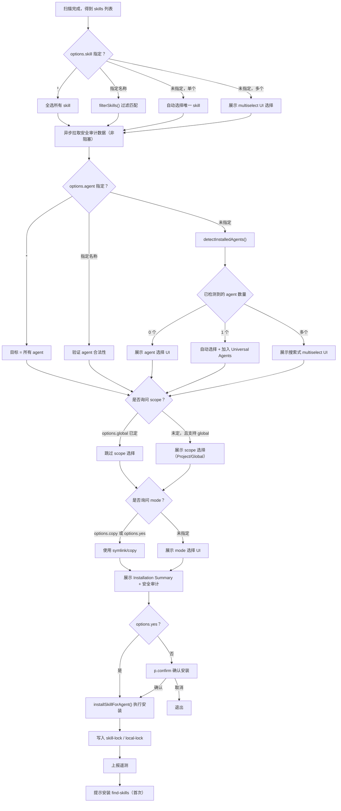

# 技能选择与安装执行模块

- **所属命令**: `skills add`
- **主要职责**: 基于已发现的 skill 列表，通过交互式 UI 让用户选择 skill、目标 agent、安装 scope 和 mode，然后执行实际安装并写入锁文件
- **关键入口**: `runAdd()` 中 skill 选择 → agent 选择 → scope 选择 → mode 选择 → `installSkillForAgent()`

## 逻辑流程（Mermaid）

## 关键依赖

- `src/installer.ts` → `installSkillForAgent()`, `isSkillInstalled()`, `getCanonicalPath()`
- `src/agents.ts` → `detectInstalledAgents()`, `agents`, `getUniversalAgents()`
- `src/skill-lock.ts` → `addSkillToLock()`, `fetchSkillFolderHash()`
- `src/local-lock.ts` → `addSkillToLocalLock()`, `computeSkillFolderHash()`
- `src/telemetry.ts` → `fetchAuditData()`, `track()`

## 涉及代码映射

- **组件与文件**：
  - `runAdd` / `src/add.ts`（主流程，约 900 行）
  - `handleWellKnownSkills` / `src/add.ts`（well-known 分支）
  - `selectAgentsInteractive` / `src/add.ts`（agent 选择 UI）
  - `promptForFindSkills` / `src/add.ts`（安装后提示）
- **关键函数**：
  - `filterSkills(skills, names)` — 模糊匹配 skill 名称
  - `detectInstalledAgents()` — 检测本机已安装的 agent
  - `installSkillForAgent(skill, agent, options)` — 核心安装
  - `ensureUniversalAgents(agents)` — 保证 Universal Agent 始终包含
- **关键状态字段**：
  - `selectedSkills`：用户最终选择的 skill 列表
  - `targetAgents`：目标 agent 列表
  - `installGlobally`：是否全局安装
  - `installMode`：`'symlink' | 'copy'`
  - `tempDir`：临时目录（finally 清理）

## 节点索引表

| ID | 节点说明 | 类型 |
|----|---------|------|
| SEL01 | 技能发现完成 | 开始节点 |
| SEL07 | 异步拉取安全审计（非阻塞） | API 节点 |
| SEL11 | `detectInstalledAgents()` 检测本机 agent | API 节点 |
| SEL22 | 展示安装摘要（含安全评级） | 处理节点 |
| SEL25 | `installSkillForAgent()` 执行安装 | API 节点 |
| SEL27 | 写入 skill-lock / local-lock | 处理节点 |
| SEL28 | 上报遥测 | API 节点 |
| SEL29 | 提示安装 find-skills | 处理节点 |
