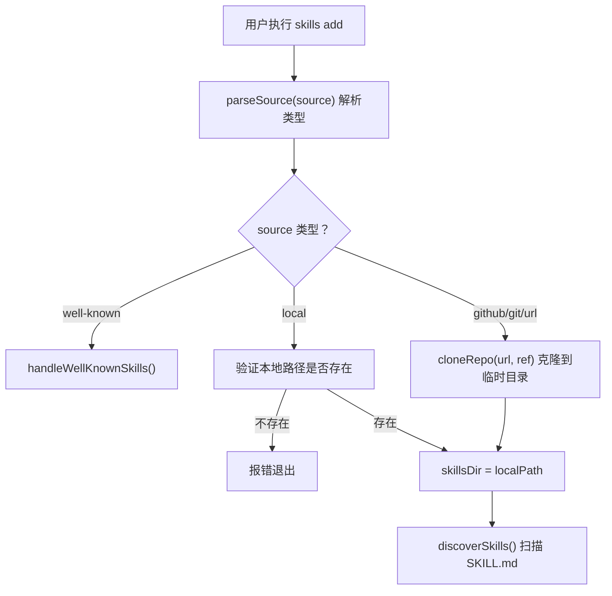

# 源解析与仓库克隆模块

- **所属命令**: `skills add`
- **主要职责**: 解析用户输入的 source 字符串（GitHub 短链、完整 URL、本地路径、Well-Known 端点），按类型执行 git clone 或本地路径验证
- **关键入口**: `runAdd()` 中 `parseSource(source)` → `cloneRepo()` / 本地路径验证

## 逻辑流程（Mermaid）

## 关键依赖

- `src/source-parser.ts` → `parseSource()`：返回 `{ type, url, ref, subpath, skillFilter }`
- `src/git.ts` → `cloneRepo(url, ref)`：返回临时目录路径
- `src/skills.ts` → `discoverSkills(dir, subpath, options)`：递归发现 SKILL.md

## 依赖的接口清单

| 服务 | 接口 | 说明 |
|------|------|------|
| GitHub API | `https://github.com/<owner>/<repo>.git` | git clone 目标 |
| skills.sh | `https://skills.sh/<source>` | 安全审计数据（见 feat-skill-select-and-install.md） |

## 涉及代码映射

- **组件与文件**：
  - `runAdd` / `src/add.ts`
  - `parseSource` / `src/source-parser.ts`
  - `cloneRepo`, `cleanupTempDir`, `GitCloneError` / `src/git.ts`
- **关键函数**：
  - `parseAddOptions(args)` — 解析 CLI 参数
  - `parseSource(source)` — 识别源类型
  - `cloneRepo(url, ref)` — 克隆仓库
- **关键状态字段**：
  - `parsed.type`：`'local' | 'github' | 'git' | 'well-known'`
  - `tempDir`：临时目录路径（finally 中清理）
  - `skillsDir`：实际扫描路径

## 节点索引表

| ID | 节点说明 | 类型 |
|----|---------|------|
| ADD01 | 用户执行 `skills add <source>` | 开始节点 |
| ADD02 | `parseSource()` 解析 source 类型 | 处理节点 |
| ADD03 | 判断 source 类型 | 决策节点 |
| ADD04 | 进入 Well-Known 安装流程 | 跳转节点 |
| ADD05 | 验证本地路径 | 处理节点 |
| ADD06 | git clone 远程仓库 | API 节点 |
| ADD07 | 报错退出（路径不存在） | 异常节点 |
| ADD08 | 确定 skillsDir | 处理节点 |
| ADD09 | `discoverSkills()` 扫描技能 | 处理节点 |
