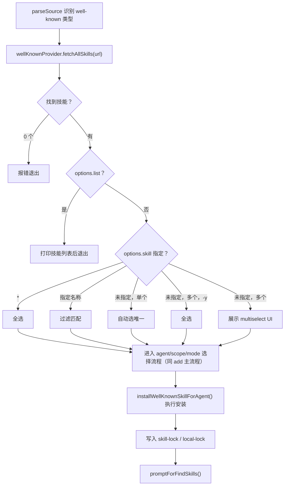

# Well-Known 端点安装模块

- **所属命令**: `skills add`
- **主要职责**: 处理来自任意域名 `/.well-known/skills/index.json` 端点发现的技能，与普通 GitHub 安装流程并行但独立
- **关键入口**: `handleWellKnownSkills(source, url, options, spinner)` — 在 `parseSource` 返回 `type='well-known'` 时触发

## 逻辑流程（Mermaid）

## 关键依赖

- `src/providers/index.ts` → `wellKnownProvider.fetchAllSkills(url)`
- `src/installer.ts` → `installWellKnownSkillForAgent()`

## 涉及代码映射

- **组件与文件**：
  - `handleWellKnownSkills` / `src/add.ts`
  - `wellKnownProvider` / `src/providers/index.ts`
- **关键函数**：
  - `wellKnownProvider.fetchAllSkills(url)` — 从 `/.well-known/skills/index.json` 拉取
  - `installWellKnownSkillForAgent(skill, agent, options)` — Well-Known 专用安装方法
  - `wellKnownProvider.getSourceIdentifier(url)` — 获取规范化 source 标识符
