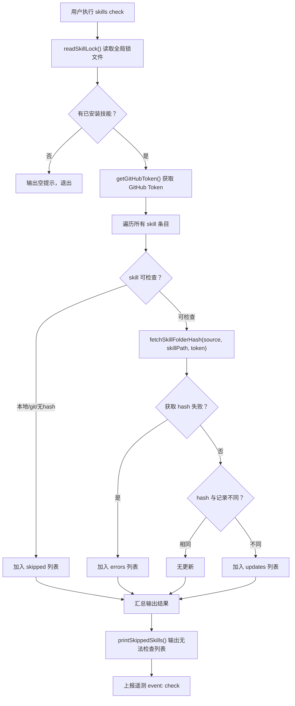

# 检查更新模块（skills check）

- **所属命令**: `skills check`
- **主要职责**: 读取全局锁文件，对每个可检查的技能通过 GitHub Trees API 获取最新 hash，对比后输出是否有更新，不执行实际更新操作
- **关键入口**: `runCheck(args)` / `src/cli.ts`

## 逻辑流程（Mermaid）

## 关键依赖

- `src/skill-lock.ts` → `fetchSkillFolderHash(source, skillPath, token)`：调用 GitHub Trees API
- `getGitHubToken()`：从 `GITHUB_TOKEN` 或 `~/.gitconfig` 中读取 Token

## 涉及代码映射

- **组件与文件**：
  - `runCheck(args)` / `src/cli.ts`
  - `readSkillLock()` / `src/cli.ts`
  - `getSkipReason(entry)` / `src/cli.ts`
  - `printSkippedSkills(skipped)` / `src/cli.ts`
- **关键函数**：
  - `fetchSkillFolderHash(source, skillPath, token)` / `src/skill-lock.ts` — GitHub Trees API 调用
  - `getGitHubToken()` — 获取 Token 提高 API 速率限制
- **关键状态字段**：
  - `entry.skillFolderHash`：记录的 GitHub tree SHA
  - `entry.skillPath`：技能在仓库中的相对路径
  - `updates`：有更新的技能列表
  - `skipped`：无法自动检查的技能列表

## 节点索引表

| ID | 节点说明 | 类型 |
|----|---------|------|
| CK01 | 用户执行 `skills check` | 开始节点 |
| CK02 | 读取全局锁文件 | 处理节点 |
| CK09 | GitHub Trees API 获取最新 hash | API 节点 |
| CK12 | 比对 hash 判断是否有更新 | 决策节点 |
| CK14 | 确认有更新 | 处理节点 |
| CK17 | 上报遥测 | API 节点 |
