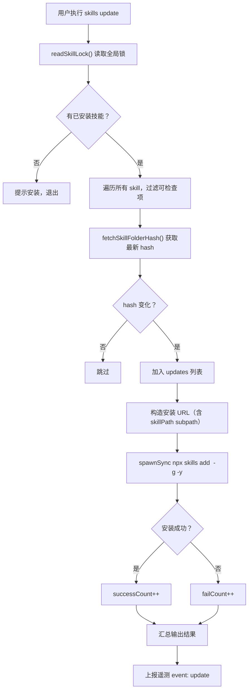

# 执行更新模块（skills update）

- **所属命令**: `skills update` / `skills upgrade`
- **主要职责**: 检测到有更新的技能后，自动调用 `npx skills add <url> -g -y` 重新安装最新版本
- **关键入口**: `runUpdate()` / `src/cli.ts`

## 逻辑流程（Mermaid）



## 关键实现细节

- 更新 URL 构造规则：
  ```
  sourceUrl（去掉 .git）+ /tree/main/ + skillFolder
  例：https://github.com/owner/repo/tree/main/skills/my-skill
  ```
- 始终使用 `forceRefresh: true`（直接用 GitHub Trees API）确保 hash 准确

## 涉及代码映射

- **组件与文件**：
  - `runUpdate()` / `src/cli.ts`
- **关键函数**：
  - `spawnSync('npx', ['-y', 'skills', 'add', installUrl, '-g', '-y'])` — 子进程重装

## 节点索引表

| ID | 节点说明 | 类型 |
|----|---------|------|
| UP01 | 用户执行 `skills update` | 开始节点 |
| UP06 | GitHub Trees API 获取最新 hash | API 节点 |
| UP10 | 构造重装 URL | 处理节点 |
| UP11 | `spawnSync` 调用 `npx skills add` 重装 | API 节点 |
| UP16 | 上报遥测 | API 节点 |
