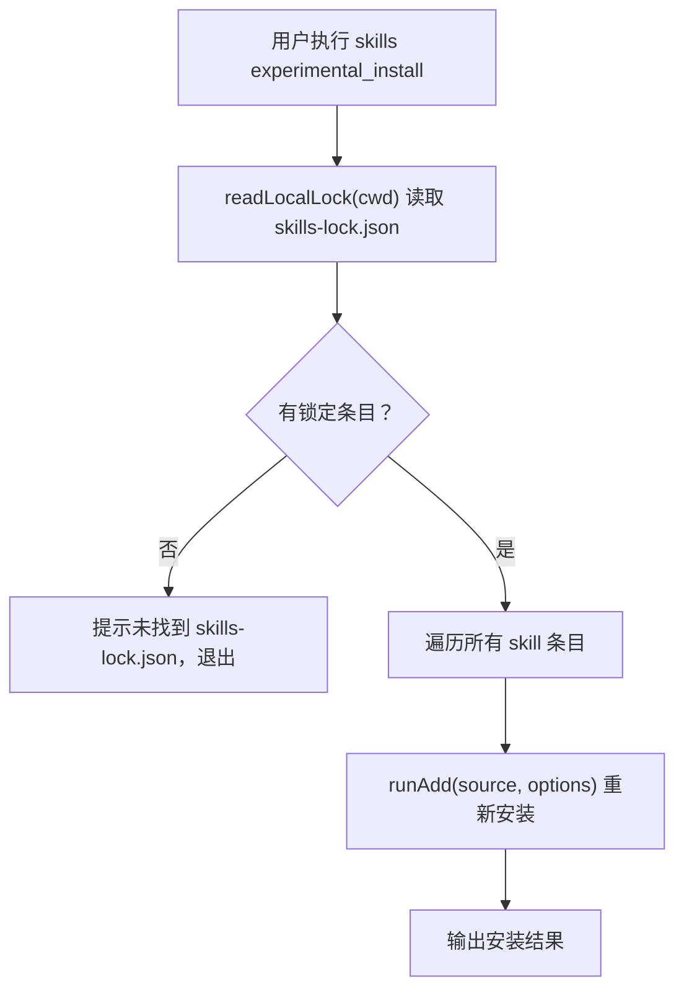

# cmd-experimental_install 命令说明

- **命令**: `skills experimental_install` （别名：`i`, `install`（无参数时）
- **入口文件**: `src/install.ts` → `runInstallFromLock(args)`，由 `src/cli.ts` 路由
- **命令角色**: 从项目的 `skills-lock.json` 锁文件恢复所有技能，用于 CI 环境或新机器克隆项目后自动还原技能配置

## 功能模块一览

- **锁文件读取**：读取 `<cwd>/skills-lock.json`（本地锁文件）
- **批量重装**：对锁文件中每个 skill 条目调用 `runAdd()` 执行安装
- **跳过已安装**：（推测）可能比对已安装状态避免重复
- **进度输出**：显示安装进度

## 关键流程（Mermaid）

## 涉及代码映射

- **组件与文件**：
  - `runInstallFromLock(args)` / `src/install.ts`
  - `readLocalLock(cwd)` / `src/local-lock.ts`
  - `runAdd()` / `src/add.ts`
