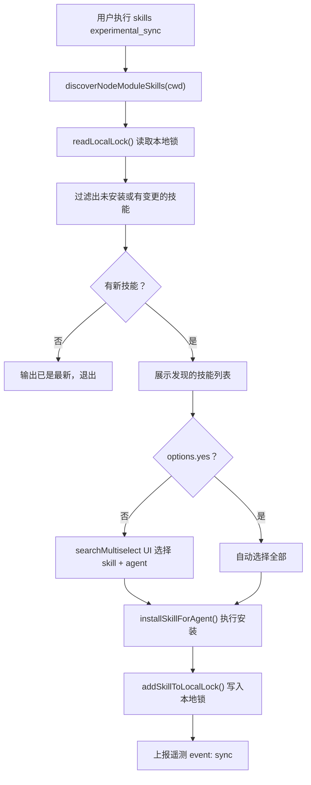

# cmd-experimental_sync 命令说明

- **命令**: `skills experimental_sync`
- **入口文件**: `src/sync.ts` → `runSync(args, options)`，由 `src/cli.ts` 路由
- **命令角色**: 扫描当前项目的 `node_modules` 目录，发现依赖包中的 SKILL.md 文件，并将其安装到 agent 目录，使 npm 包中自带的技能可以被 agent 使用

## 功能模块一览

- **node_modules 遍历**：`discoverNodeModuleSkills(cwd)` 递归遍历 `node_modules` 下所有包（包括 `@scope/pkg` 格式），查找 SKILL.md
- **比对本地锁**：`readLocalLock()` 读取 `skills-lock.json`，过滤出未安装或有变更的技能
- **交互式选择**：展示发现的技能列表，让用户选择要安装的技能和目标 agent
- **执行安装**：调用 `installSkillForAgent()` 安装
- **写入本地锁**：`addSkillToLocalLock()` 记录已安装的 skill 信息

## 关键流程（Mermaid）

## 涉及代码映射

- **组件与文件**：
  - `runSync(args, options)` / `src/sync.ts`
  - `parseSyncOptions(args)` / `src/sync.ts`
  - `discoverNodeModuleSkills(cwd)` / `src/sync.ts`
  - `readLocalLock()`, `addSkillToLocalLock()` / `src/local-lock.ts`
  - `installSkillForAgent()` / `src/installer.ts`
- **关键函数**：
  - `discoverNodeModuleSkills(cwd)` — 遍历 node_modules 查找 SKILL.md，支持 scoped 包（`@org/pkg`）
  - `computeSkillFolderHash(dir)` — 计算技能目录 hash 用于变更检测
