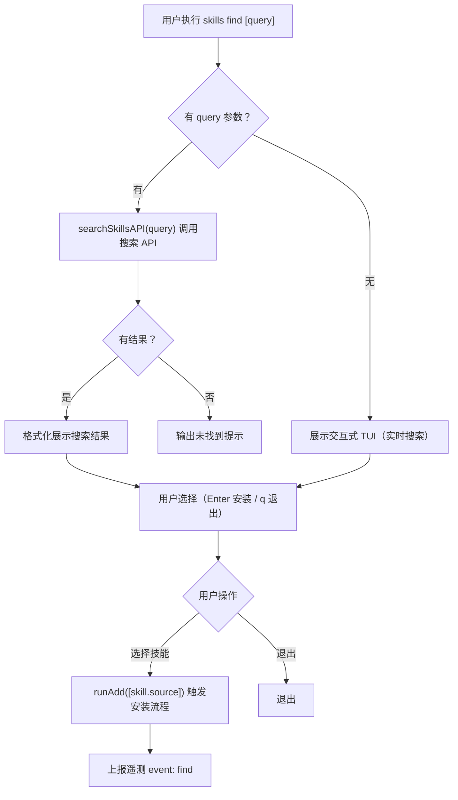

# 技能搜索与安装模块

- **所属命令**: `skills find`
- **主要职责**: 调用 skills.sh 搜索 API 获取技能列表，提供交互式 TUI 让用户浏览并安装
- **关键入口**: `runFind(args)` / `src/find.ts`

## 逻辑流程（Mermaid）

## 关键依赖

- `src/find.ts` → `searchSkillsAPI(query)`：GET `https://skills.sh/api/search?q=<query>&limit=10`
- `src/add.ts` → `runAdd()`, `parseAddOptions()`

## 涉及代码映射

- **组件与文件**：
  - `runFind(args)` / `src/find.ts`
  - `searchSkillsAPI(query)` / `src/find.ts`
- **关键函数**：
  - `formatInstalls(count)` — 格式化安装次数（K/M 后缀）
  - `runAdd()` — 触发安装
- **关键状态字段**：
  - `SEARCH_API_BASE`：可通过 `SKILLS_API_URL` 环境变量覆盖
