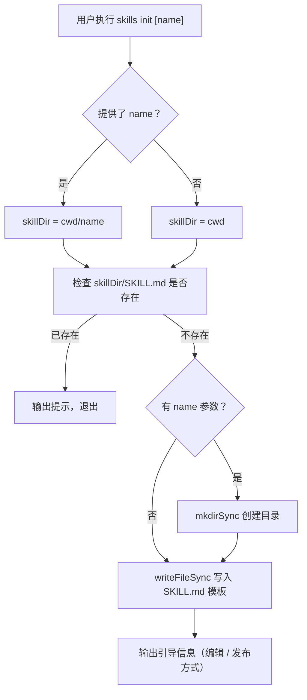

# cmd-init 命令说明

- **命令**: `skills init [name]`
- **入口文件**: `src/cli.ts` → `runInit(args)`
- **命令角色**: 在当前目录（或指定子目录）初始化一个新的 SKILL.md 模板文件，帮助用户快速创建自己的技能包

## 功能模块一览

- **参数解析**：`name` 可选，若提供则在 `<cwd>/<name>/SKILL.md` 创建，否则在 `<cwd>/SKILL.md` 创建
- **重复检查**：若目标路径已存在 SKILL.md，提示已存在并退出
- **目录创建**：若有 name 参数，`mkdirSync` 递归创建目录
- **模板写入**：写入包含 frontmatter（name、description）和占位说明的 Markdown 模板
- **引导输出**：提示下一步编辑、发布方法

## 关键流程（Mermaid）

## 涉及代码映射

- **函数**: `runInit(args)` / `src/cli.ts`
- **关键模板字段**：
  - `name`：技能名称（从 args[0] 或当前目录名）
  - `description`：占位描述文字
