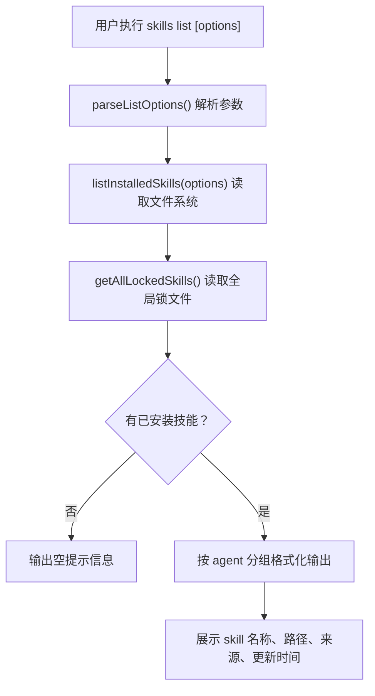

# 技能列表查询模块

- **所属命令**: `skills list`
- **主要职责**: 读取文件系统中已安装的技能，结合锁文件 source 信息，格式化展示
- **关键入口**: `runList(args)` / `src/list.ts`

## 逻辑流程（Mermaid）

## 涉及代码映射

- **组件与文件**：
  - `runList(args)` / `src/list.ts`
  - `parseListOptions(args)` / `src/list.ts`
  - `listInstalledSkills(options)` / `src/installer.ts`
  - `getAllLockedSkills()` / `src/skill-lock.ts`
- **关键状态字段**：
  - `options.global`：是否查看全局安装
  - `options.agent`：按 agent 过滤
