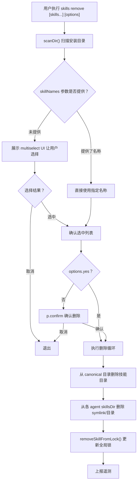

# 技能删除执行模块

- **所属命令**: `skills remove`
- **主要职责**: 扫描已安装技能、交互式或按名称选择目标技能、从文件系统中删除对应目录/符号链接并更新锁文件
- **关键入口**: `removeCommand(skillNames, options)` / `src/remove.ts`

## 逻辑流程（Mermaid）

## 关键依赖

- `src/installer.ts` → `getInstallPath()`, `getCanonicalPath()`, `getCanonicalSkillsDir()`, `sanitizeName()`
- `src/skill-lock.ts` → `removeSkillFromLock()`, `getSkillFromLock()`
- `src/agents.ts` → `detectInstalledAgents()`, `agents`

## 涉及代码映射

- **组件与文件**：
  - `removeCommand(skillNames, options)` / `src/remove.ts`
  - `parseRemoveOptions(args)` / `src/remove.ts`
- **关键函数**：
  - `scanDir(dir)` — 扫描目录获取已安装技能名称
  - `getInstallPath(skillName, agent, options)` — 获取 agent 的安装路径
  - `getCanonicalPath(skillName, options)` — 获取规范安装路径
  - `removeSkillFromLock(skillName)` — 从全局锁文件删除
- **关键状态字段**：
  - `skillNamesSet`：扫描到的所有已安装技能名称集合
  - `isGlobal`：是否操作全局范围

## 节点索引表

| ID | 节点说明 | 类型 |
|----|---------|------|
| RM01 | 用户执行 `skills remove` | 开始节点 |
| RM02 | 扫描安装目录 | 处理节点 |
| RM04 | 展示多选 UI | 处理节点 |
| RM11 | 执行删除循环 | 处理节点 |
| RM12 | 删除 canonical 目录中的技能 | 处理节点 |
| RM13 | 删除各 agent 的 symlink/目录 | 处理节点 |
| RM14 | 更新全局锁文件 | 处理节点 |
