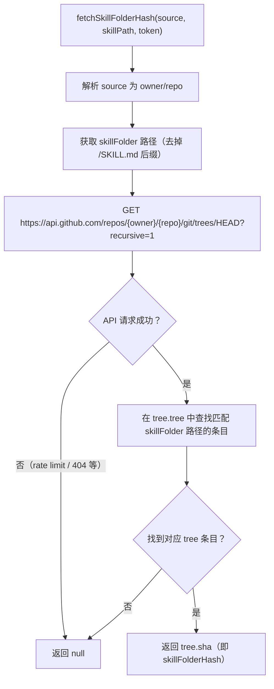

# Hash 检测更新模块

- **所属模块**: `src/skill-lock.ts`
- **主要职责**: 通过 GitHub Trees API 获取技能目录的最新 tree SHA，与锁文件中记录的 `skillFolderHash` 对比，判断技能是否有更新
- **关键入口**: `fetchSkillFolderHash(source, skillPath, token)` / `src/skill-lock.ts`

## 逻辑流程（Mermaid）

## 关键实现细节

- GitHub Trees API 端点：`GET /repos/{owner}/{repo}/git/trees/HEAD?recursive=1`
- 使用 `GITHUB_TOKEN` 环境变量或 `git config user.token` 提高速率限制（60 → 5000 req/h）
- 锁文件 v3 才引入 `skillFolderHash`；旧版锁文件会被清空，需重新安装

## 涉及代码映射

- **关键函数**：
  - `fetchSkillFolderHash(source, skillPath, token)` / `src/skill-lock.ts`
  - `getGitHubToken()` / `src/skill-lock.ts`
- **关键状态字段**：
  - `entry.skillFolderHash`：已记录的 hash，与最新 hash 比对
  - `CURRENT_VERSION = 3`：当前锁文件版本

## 节点索引表

| ID | 节点说明 | 类型 |
|----|---------|------|
| HC01 | 调用 fetchSkillFolderHash | 开始节点 |
| HC04 | GitHub Trees API 请求 | API 节点 |
| HC05 | API 是否成功 | 决策节点 |
| HC07 | 在 tree 中查找 skillFolder | 处理节点 |
| HC09 | 返回最新 skillFolderHash | 结束节点 |
